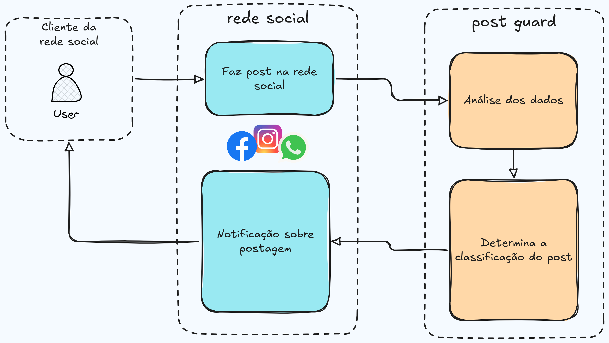
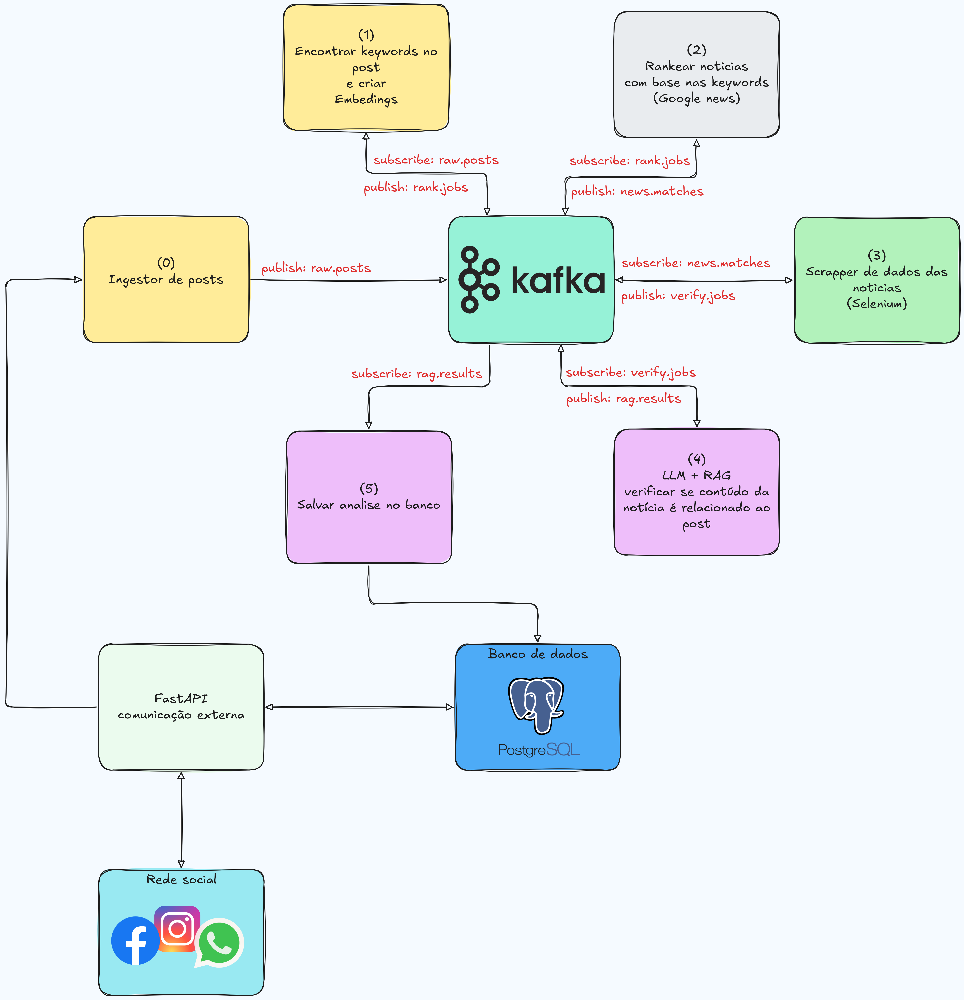

# Post Guard

Como rodar a aplicação:
- Como é uma aplicação em microserviços, cada um deve ser rodado em uma máquina separada
- Todos estão com docker compose dentro de suas respectivas pastas
- Para rodar, utilize docker compose up
- As máquinas utilizadas devem ter um servidor de ollama rodando (https://ollama.com/)
- Devem ser informados em varáveis de ambiente todas as URLs dos serviços

## Fluxo do Sistema

## Arquitetura da Aplicação

